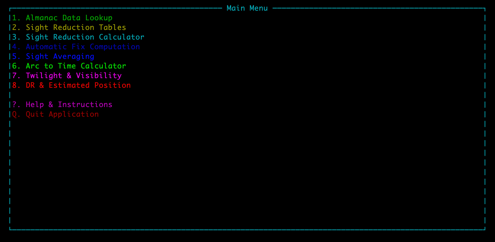
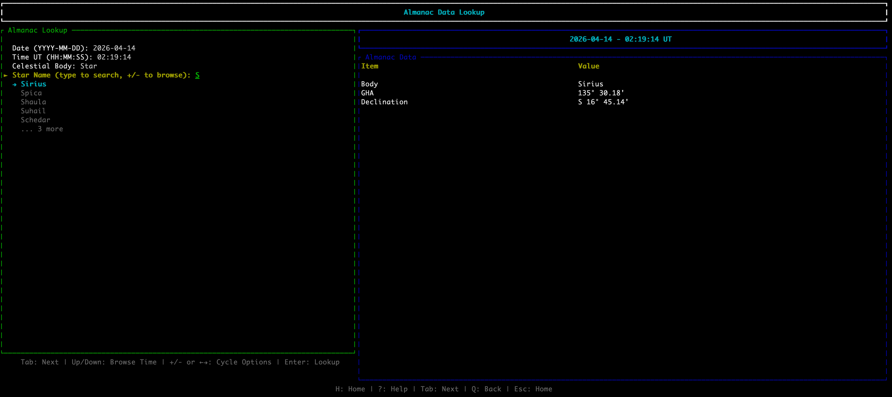
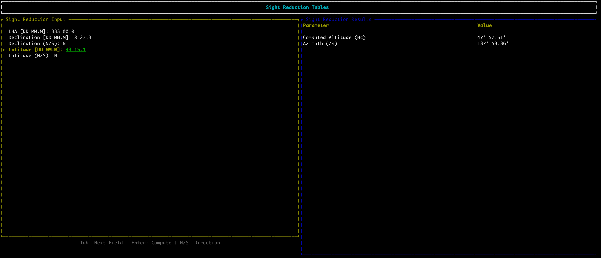
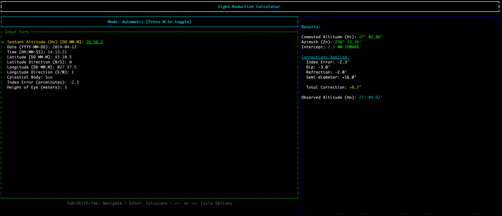
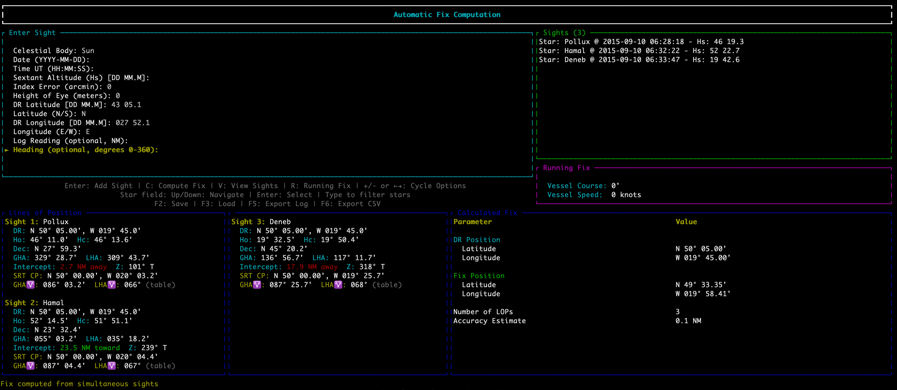
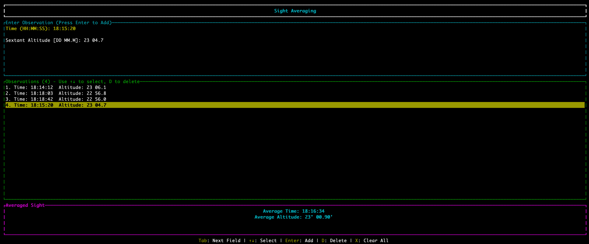
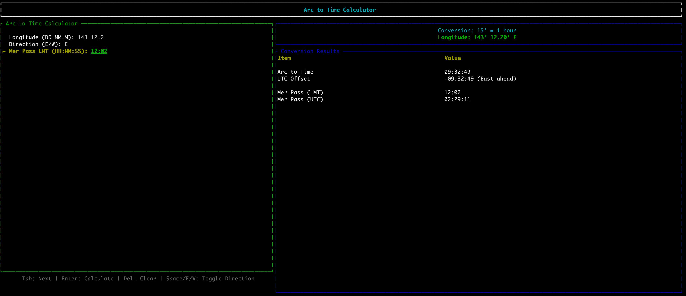
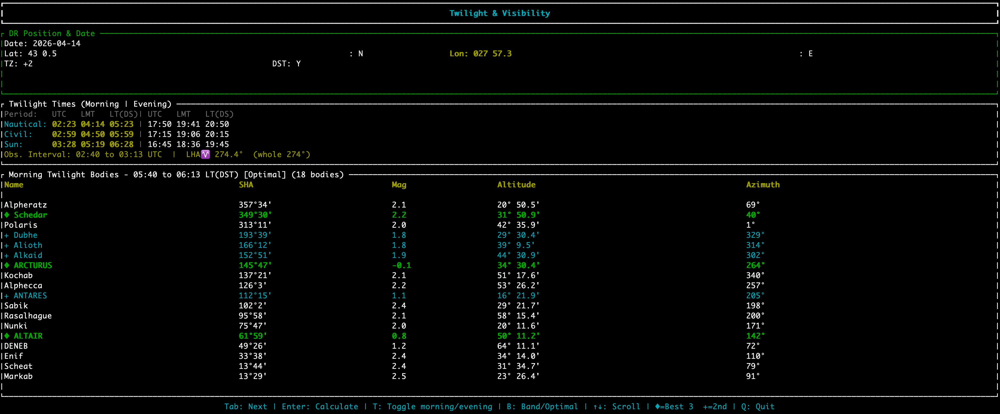
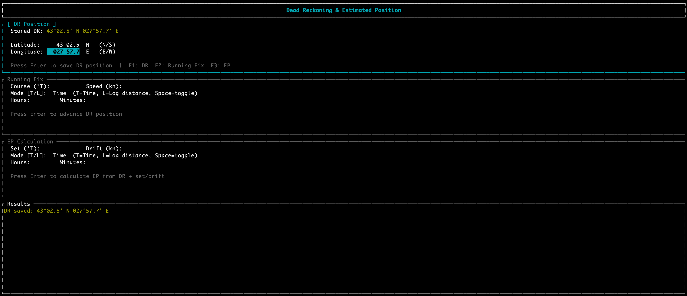

# CelTUI — Celestial Navigation Terminal UI

A terminal-based celestial navigation assistant built with [Ratatui](https://ratatui.rs) in Rust.
CelTUI covers the full sight-reduction workflow — from almanac lookup and altitude corrections
through to running fixes and twilight planning — without requiring paper tables or a calculator.

> **Disclaimer:** CelTUI is a study and practice aid. Computed almanac and sight reduction values
> may differ slightly from published tables. Do not rely on it as your sole tool for navigation at sea.

---

<!-- screenshot: main menu -->


---

## Features

| # | Screen | Purpose |
|---|--------|---------|
| 1 | [Almanac Lookup](#1-almanac-lookup) | GHA and Declination for any body at a given UTC time |
| 2 | [Sight Reduction Tables](#2-sight-reduction-tables) | Hc and Zn from LHA / Dec / Lat — replaces Pub. 249/229 |
| 3 | [Sight Reduction Calculator](#3-sight-reduction-calculator) | Full sight reduction with automatic altitude corrections |
| 4 | [Automatic Fix Computation](#4-automatic-fix-computation) | Multi-LOP fix from several sights, including running fixes |
| 5 | [Sight Averaging](#5-sight-averaging) | Average a series of observations to reduce measurement error |
| 6 | [Arc to Time](#6-arc-to-time-calculator) | Convert longitude (arc) to a time offset for meridian passage |
| 7 | [Twilight & Visibility](#7-twilight--visibility) | Twilight windows and which bodies are visible for observation |
| 8 | [DR & Estimated Position](#8-dr--estimated-position) | Dead reckoning, running fix, and set/drift EP |

---

## Installation

### Pre-built binaries

Download the latest release for your platform from the [Releases](../../releases) page:

| Platform | File |
|----------|------|
| Linux x86-64 | `celtui-x86_64-unknown-linux-gnu.tar.gz` |
| Linux ARM64 | `celtui-aarch64-unknown-linux-gnu.tar.gz` |
| macOS Intel | `celtui-x86_64-apple-darwin.tar.gz` |
| macOS Apple Silicon | `celtui-aarch64-apple-darwin.tar.gz` |
| Windows x64 | `celtui-x86_64-pc-windows-msvc.zip` |

### Build from source

```bash
git clone https://github.com/YOUR_USERNAME/celtui.git
cd celtui
cargo build --release -p celtui
./target/release/celtui
```

Requires Rust 1.75+ (stable).

---

## Navigation

- **Number keys 1–8** or **hotkeys** (`A` Almanac, `S` Sight Reduction, `C` Calculator,
  `V` Auto Fix, `T` Sight Averaging, `W` Twilight, `D` DR/EP): jump to a screen
- **Tab / Shift-Tab**: move between fields
- **Enter**: execute the current action
- **Q**: quit / return to the main menu
- **?**: show the help screen

---

## Screen Reference

### 1. Almanac Lookup

Look up the Greenwich Hour Angle (GHA) and Declination for any navigational body at a given UTC date and time.

**Bodies:** Sun, Moon, Venus, Mars, Jupiter, Saturn, Aries, and all 58 navigational stars.
Stars are searchable by name with `+`/`-` to browse matches.

**Outputs:** GHA and Declination in degrees and arcminutes.

<!-- screenshot: almanac screen -->


---

### 2. Sight Reduction Tables

Emulates the Pub. 249 / Pub. 229 sight reduction tables.
Enter whole-degree values for LHA, Declination, and Latitude to obtain Hc and Zn.

**Inputs:** LHA · Declination (N/S) · Latitude (N/S)
**Outputs:** Computed altitude Hc · True azimuth Zn

<!-- screenshot: sight reduction tables screen -->


---

### 3. Sight Reduction Calculator

Full sight reduction for a single sight with automatic almanac lookup and all altitude corrections applied.

**Automatic mode** — fill in the observation and let CelTUI fetch GHA and declination:

| Field | Description |
|-------|-------------|
| Sextant Altitude (Hs) | Raw reading from the sextant |
| Date / Time UT | UTC date and time of observation |
| DR Latitude / Longitude | Dead reckoning position |
| Body | Celestial body (or star name) |
| Index Error | Sextant instrument correction (arcminutes) |
| Height of Eye | Observer height above sea level (metres) |

**Manual mode** (press `M`) — additionally provide GHA and Declination directly.

**Corrections applied:** refraction · dip · semidiameter (Sun/Moon) · parallax · index error

**Outputs:** Hc · Ho (observed altitude) · Intercept (NM toward/away) · True azimuth Zn

<!-- screenshot: sight reduction calculator screen -->


---

### 4. Automatic Fix Computation

Enter multiple sights and compute a celestial fix from the intersecting Lines of Position (LOPs).
Supports running fixes via log readings and vessel heading.

**Per-sight inputs:** Body · Date/Time UT · Hs · Index Error · Height of Eye · DR position · Log reading · Heading

**Per-sight LOP output:** Ho · Hc · Intercept (NM) · True azimuth Zn · Dec · GHA · LHA
For star sights: GHA Aries · LHA Aries · Pub. 249 optimised Chosen Position

**Fix output:** Latitude/Longitude (decimal and D° MM.M') · Number of LOPs · Accuracy estimate (NM)

**Keys:** `Enter` add sight · `C` compute fix · `V` toggle entry/view · `D` delete sight

**Export:** Press `X` to save a timestamped sight log (text report + CSV) to disk.

<!-- screenshot: automatic fix computation screen -->


---

### 5. Sight Averaging

Reduce random error by averaging several observations of the same body taken within a short interval (< 5 minutes).
Altitude changes linearly over short periods — inspect the list and delete outliers before averaging.

**Inputs (per observation):** Time · Sextant Altitude
**Output:** Mean time · Mean altitude · Observation count

**Keys:** `Enter` add · `D` delete last · `X` clear all

<!-- screenshot: sight averaging screen -->


---

### 6. Arc to Time Calculator

Converts longitude (arc) to a time offset from UTC, and optionally converts a Local Mean Time (LMT)
meridian passage to UTC.

**Rules:** 15° = 1 h · 15' = 1 min · 15" = 1 s · East = ahead (+) · West = behind (−)

**Inputs:** Longitude (D° MM.M') · Direction (E/W) · Meridian Passage LMT (optional)
**Outputs:** Time offset (h m s) · Meridian Passage UTC

<!-- screenshot: arc to time screen -->


---

### 7. Twilight & Visibility

Calculate civil and nautical twilight windows for a given date and position, and list which
stars and planets are visible for sextant observation during that window.

**Inputs:** Date · DR Position · Timezone offset · DST flag
**Outputs:**
- Civil and nautical twilight start/end times (local and UTC)
- Observation interval (start → end)
- Visible bodies: name · altitude · azimuth · GHA · Dec · SHA · visibility rating

Press `T` to toggle between morning and evening twilight.

<!-- screenshot: twilight planning screen -->


---

### 8. DR & Estimated Position

Manage your Dead Reckoning (DR) position and compute position advances. The stored DR position
is shared automatically with the Calculator, Auto Fix, and Twilight screens.

Three sections (switch with `F1` / `F2` / `F3`):

**F1 — DR Position:** Enter and save your current DR (persisted across sessions in `dr_ep.json`).

**F2 — Running Fix:** Advance the DR position by course, speed, and time (or log distance).

**F3 — EP Calculation:** Apply a known set and drift to the DR to compute an Estimated Position.

<!-- screenshot: DR and EP screen -->


---

## Release Management

Use the included `release.sh` script to bump the version, tag, and push a new release.
GitHub Actions will build binaries for all five platforms automatically.

```bash
./release.sh --current        # show current version
./release.sh patch            # 0.1.0 → 0.1.1  (bug fix)
./release.sh minor            # 0.1.0 → 0.2.0  (new feature)
./release.sh major            # 0.1.0 → 1.0.0  (breaking change)
```

The script runs `cargo clippy` and `cargo check` before committing, then creates an annotated
tag that triggers the CI release workflow.

---

## Why CelTUI?

During my study of Celestial Navigation for the YMO course I found myself making arithmetic
mistakes and spending more time with PDFs and paper tables than understanding the process itself.
CelTUI was built to handle the arithmetic so the focus stays on the navigation.

---

## Licence

GNU General Public License v2.0 only — see [LICENSE](LICENSE).
